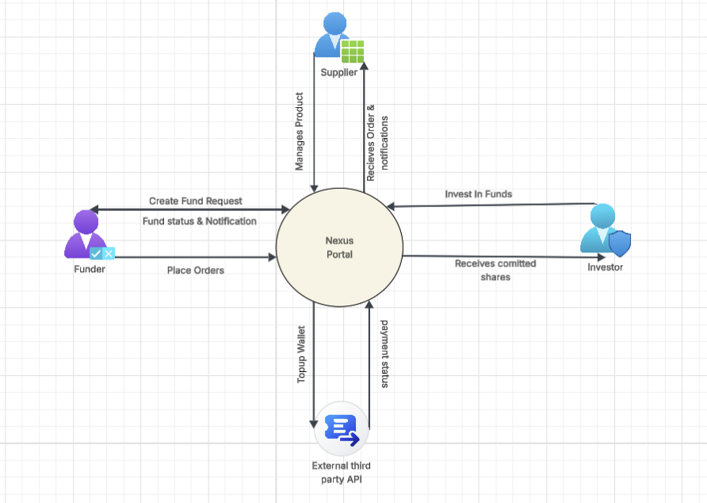
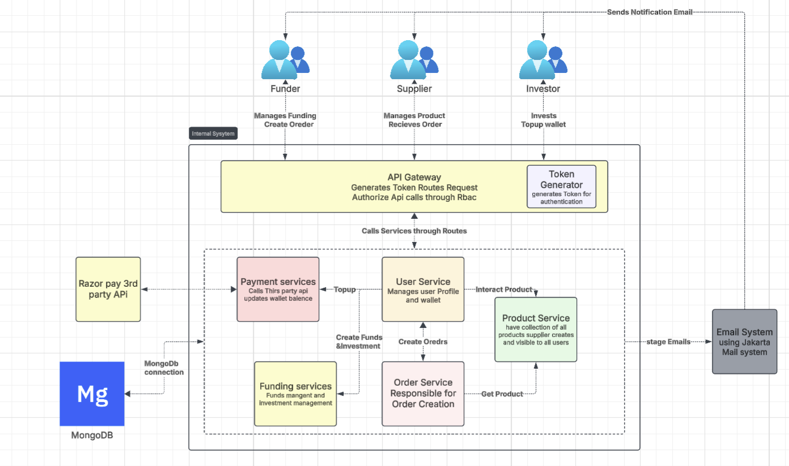

# Nexus Collaborative Supply Chain Platform

A comprehensive microservices-based collaborative supply chain platform enabling multi-role user management, investment funding, product catalog management, and order processing with real-time notifications and performance monitoring.

## Project Structure

```
APIBP-20242YB-Team-03/
├── README.md                       # This file
├── docker-compose.yml              # Multi-service orchestration
├── images/                         # Architecture diagrams
│   ├── context-diagram.png
│   └── container-diagram.png
├── apispec/                        # OpenAPI specifications
│   ├── user-service.yaml
│   ├── product-service.yaml
│   ├── investment-service.yaml
│   ├── order-service.yaml
│   ├── payment-service.yaml
│   └── funding-service.yaml
├── jmeter-performance-test/        # Performance testing suite
│   ├── performance-test.jmx
│   ├── execute-test.sh
│   └── results/
├── logging-stack/                  # ELK stack configuration  
│   ├── docker-compose.yml
│   └── logstash.conf
├── api-gateway/                    # Spring Cloud Gateway
├── user-service/                   # User management microservice
├── product-service/                # Product catalog microservice  
├── investment-service/             # Investment & funding microservice
├── order-service/                  # Order processing microservice
├── payment-service/                # Payment processing microservice
└── notification-service/           # Event notification microservice
```

## Architecture Overview

### Context Diagram


### Container Diagram  


### Key Architecture Patterns
- **API Gateway Pattern**: Centralized authentication, routing, and security
- **Microservices Architecture**: Domain-driven service decomposition
- **Event-Driven Communication**: Kafka-based asynchronous messaging
- **CQRS**: Separate read/write operations for optimal performance
- **Circuit Breaker**: Resilient inter-service communication

## Quick Start

### Prerequisites
- Java 17+ - Runtime environment
- Docker & Docker Compose - Container orchestration
- Maven 3.6+ - Build tool
- JMeter - Performance testing (optional)

### One-Command Setup
```bash
# Clone and start the entire platform
git clone <repository-url>
cd APIBP-20242YB-Team-03
docker-compose up -d
```

### Access Points
- **API Gateway**: http://localhost:8080
- **Kibana Dashboard**: http://localhost:5601
- **Kafka UI**: http://localhost:9092 (internal)

## Microservices Portfolio

| Service | Port | Technology | Database | Purpose | Health Check |
|---------|------|------------|----------|---------|--------------|
| **API Gateway** | 8080 | Spring Cloud Gateway | - | Authentication, Routing & Security | `GET /actuator/health` |
| **User Service** | 3000 | Spring Boot + WebFlux | MongoDB | User Management & Wallet Operations | `GET /api/v1/health` |
| **Product Service** | 3002 | Spring Boot | MongoDB | Product Catalog & Inventory | `GET /api/v1/health` |
| **Investment Service** | 3004 | Spring Boot | MongoDB | Funding Requests & Investments | `GET /api/v1/health` |
| **Order Service** | 3007 | Spring Boot + Kafka | MongoDB | Order Processing & Fulfillment | `GET /api/v1/health` |
| **Payment Service** | 3006 | Spring Boot | MongoDB | Payment Processing & Transactions | `GET /api/v1/health` |
| **Notification Service** | 3005 | Spring Boot + Kafka | - | Event-driven Notifications | `GET /api/v1/health` |

### Infrastructure Services
| Service | Port | Purpose | Access |
|---------|------|---------|---------|
| **Zookeeper** | 2182 | Kafka Coordination | Internal |
| **Kafka** | 9092 | Message Broker | Internal |
| **Elasticsearch** | 9200 | Log Storage & Search | Internal |
| **Logstash** | 3008 | Log Processing | Internal |
| **Kibana** | 5601 | Log Visualization | http://localhost:5601 |

## User Roles & Capabilities

### SUPPLIER
- **Product Management**: Create, update, and manage product catalog
- **Inventory Control**: Track stock levels and availability
- **Order Fulfillment**: Update order status and confirm deliveries

### FUNDER  
- **Funding Requests**: Create investment funding opportunities
- **Order Placement**: Purchase products and manage orders
- **Payment Management**: Process transactions and track spending

### INVESTOR
- **Investment Opportunities**: Browse and fund investment requests
- **Portfolio Management**: Track investment performance and returns
- **Profit Distribution**: Receive and manage profit shares

### ADMIN
- **User Management**: Create, update, and manage all users
- **System Configuration**: Manage platform settings and policies
- **Monitoring**: Oversee system health and performance

## Authentication & Security

### JWT-Based Authentication Flow
```bash
# 1. Login to get JWT token
POST http://localhost:8080/nexus/auth/login
{
  "email": "user@example.com",
  "password": "password"
}

# 2. Use token in subsequent requests
Authorization: Bearer <jwt-token>
```

## API Documentation

### OpenAPI Specifications
Each service provides comprehensive OpenAPI 3.0 specifications:

- **[User Service API](apispec/user-service.yaml)** - User management, authentication, wallet operations
- **[Product Service API](apispec/product-service.yaml)** - Product catalog, inventory management
- **[Investment Service API](apispec/investment-service.yaml)** - Funding requests, investment tracking  
- **[Order Service API](apispec/order-service.yaml)** - Order processing, fulfillment
- **[Payment Service API](apispec/payment-service.yaml)** - Payment processing, transactions
- **[Funding Service API](apispec/funding-service.yaml)** - Funding operations, investment management

### API Testing Collections
Each service includes Bruno/Postman collections for comprehensive API testing:

- **User Service**: `user-service/bruno-user-service/`
- **Product Service**: `product-service/bruno-product-service/`  
- **Order Service**: `order-service/bruno/`
- **API Gateway**: `api-gateway/ApiGatewayBruno/`

## Performance Testing

### JMeter Test Suite
Comprehensive performance testing suite located in `jmeter-performance-test/`:

```bash
# Run performance tests
cd jmeter-performance-test
./execute-test.sh
```

### Test Configuration
- **Load Profile**: 50 concurrent users
- **Ramp-up Time**: 30 seconds  
- **Test Duration**: 5 iterations per user
- **Results**: Generated in timestamped `results/` folders with HTML dashboard

## Local Development

### Environment Setup
```bash
# 1. Clone repository
git clone <repository-url>
cd APIBP-20242YB-Team-03

# 2. Start infrastructure services
docker-compose up -d zookeeper kafka elasticsearch logstash kibana

# 3. Start individual services (in separate terminals)
cd user-service && mvn spring-boot:run
cd product-service && mvn spring-boot:run  
cd investment-service && mvn spring-boot:run
cd order-service && mvn spring-boot:run
cd payment-service && mvn spring-boot:run
cd notification-service && mvn spring-boot:run
cd api-gateway && mvn spring-boot:run
```

## Monitoring & Logging

### ELK Stack Integration
- **Elasticsearch**: Centralized log storage and search
- **Logstash**: Log processing and transformation  
- **Kibana**: Log visualization and monitoring dashboards

### Accessing Logs
```bash
# View Kibana dashboard
open http://localhost:5601
```

## Technology Stack

- **Java 17** - Programming language
- **Spring Boot 3.x** - Application framework
- **Spring Cloud Gateway** - API gateway and routing
- **MongoDB Atlas** - Document database
- **Apache Kafka** - Event streaming platform
- **Docker & Docker Compose** - Containerization
- **ELK Stack** - Logging and monitoring
- **JMeter** - Performance testing
